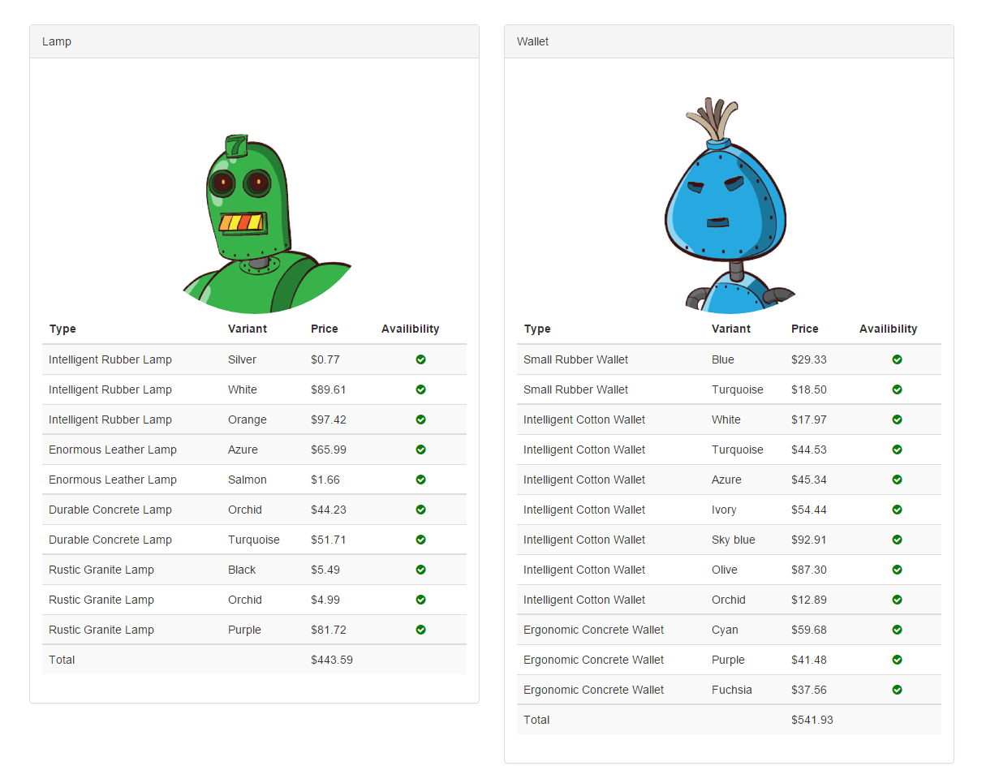

# myshop-assignment :boom::boom:
In this project, I try to solve the assignment with diffrent techniques that I know such as
- AngularJS
- JQuery
- NodeJS
- Vanilla JS

### Demo: responsive front-end for AngularJs codes
Two items are shown in two pannels, labeled by their name and information extracted from coming input JSON. e.g all the **type** and **variants** of these two items, their **price** and their **availability**.
If the item is available the green checkmark appears, otherwise a red cross will be shown.

### Assignment answer:
As you can see the `L` item costs `$443.59` and the `W` item costs `$541.93`. So the total costs is `$985.52`

### APIs and technologies so far:
- Bootstrap: to make it responsive
- Font-awesome: for availability 
